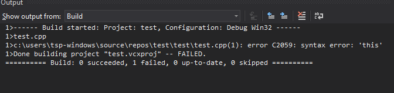
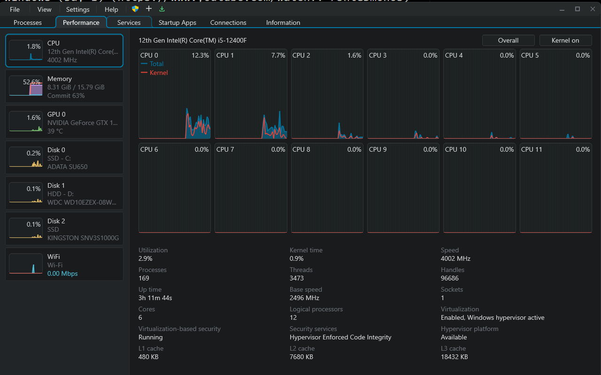
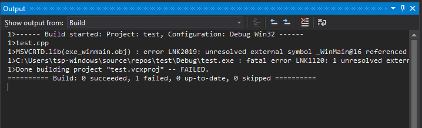
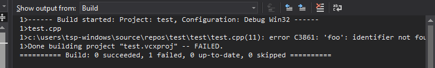

# Intro to C in Windows (Day 1) (https://www.youtube.com/watch?v=F3ntGDm6hOs)

## Output from VS



- The 1> means that it is on the first core.
  

Core is basically a standalone CPU, or at least it can act as one, it has the
ability to perform maths, address memory, and other things that you would expect
a standalong CPU can do, since CPUs nowadays can perform multiple actions at a
time, there needs to still be a distinction on what is performing that action,
in this case that is a _Core_ of the CPU.

Think of it as something that would be a CPU in the old days. However it has
been divided even further, to something called _Hyperthreads_, which means that
core can have multiple states, that it can switch through.

Sometimes, compilers, will use multicores, to compile the program, the 1> in
this case is like a _processing unit_, that is compiling that specific program.

- The "Build started: Project: test", means that it is building the "test"
  Project
- Configuration is what kind of "Build" we are building, "Debug", "Release", is
  it for Windows, MacOS ...
- The line below this is the list of files that is being compiled.

The compiling... keyword that you will see in previous iterations of VS, is
translating the file from one form to another. Imagine translating from
something Humans can read to something a CPU can read.

Now if we were to actually write in some code:

```c
void foo()
{

}
```

You will see that it gets pass the error it:



The first thing you will see, is that its getting pass the compilation portion
of the Build, but for older versions of this, there can be something called the
_Resource Compiler_, which packs up resources and linking it somewhere in the
executable, like the icon for your program.

Next we have linking, the thing is usually a project has many files, like how a
games has many cpp files, so what is done, is the compiler first compiles the
text files down to an intermediate file, this is done so that, if we have
multiple cpp files, like foo.cpp, bar.cpp...The compiler would know to only
compile the file that changed, and not the ones that has not.

However since all the cpps files need to be pulled into the executable in the
end, this brings us on to linking. Linking is the process of gathering all the
intermediate files and resolving out the places when they point to each other.

If we have a c++ file called foo.cpp and it calls a function in bar.cpp, then
the Linker would have to link the function between foo and bar, so that foo can
actually call it.

Why doesn't the compiler do this? This is due to the fact that the compiler can
also compile a single file at a time, so it doesn't actually know which
reference is where, it just knows the function call has that name.

So the linker goes and links up all the files, by resolving the references of
them, then packages it up into one executable, which you can ship? Nope those
are the good old days... but lets hold on for now.

As you can see with the error though, the linker is actually pretty bad at
telling us proper errors, we will only usually know what file or function caused
it. However, fortunately linker errors are alot more simpler than compiler
errors, so we can usually figure out what they mean, even if they are a bit
cyptic.

Looking at the error, we can see
`unresolved external symbol _WinMain@16 referenced in function __tmainCRTStartup`,
then it tells us that there is a fatal error called `one resolved externals`.

What an external is in this case, is that when we compile it, the intermediate
file of test.cpp gets produced but since the linker can't find a reference
(external) of the function foo in any external files or external part of the
program then it just panic, and gives a fatal error.

Now let us talk about what happens when we double click an exe, so first the
program that is running on your machine is Windows (or any other os), the
processor in your machine is actually executing windows, and now we have made
something that we want Windows to execute, but Windows and our program is not
linked together.

This would make sense if we wrote all the code from start to finish, basically
building the entire OS with the program that we want to execute, that would mean
that the linker could actually resolve everything, since everything would be
linked together. (however, this is also not entirely true ehem, BIOS, which
actually executes the OS).

Assuming though that Windows is the initial program that is running,

1. How does it know where to start?
2. How does it know what to do with the program executable that you made?

Well, basically the _exe_ file format, is built in a way where Windows knows how
to make sense of it, and what to do with it. So you open up an _exe_ file,
windows will load the file into memory, then it use the information that is
baked in the executable, by the linker, which tells Windows, where in the file
we want to actually start executing, telling the CPU where to start running.

The way we tell Windows where to start, is to have a defined name that tells
Windows where to start executing the program, for now let's say that it is
_WinMain_.

- Note: We are gonna be looking up alot of things.

If we search for **WinMain** in the Microsoft docs we will see the following:

```cpp
int __clrcall WinMain(
  [in]           HINSTANCE hInstance,
  [in, optional] HINSTANCE hPrevInstance,
  [in]           LPSTR     lpCmdLine,
  [in]           int       nShowCmd
);
```

This is called a function prototype, it tells us the way that the function will
start executing.

**WinMain** is the so called, entry point of the program, it tells Windows to
start executing the program here.

Now let's put that in our test.cpp program, and try to Build it again.

```cpp
int __clrcall WinMain(
  [in]           HINSTANCE hInstance,
  [in, optional] HINSTANCE hPrevInstance,
  [in]           LPSTR     lpCmdLine,
  [in]           int       nShowCmd
)
{
}

void foo()
{
}
```

Now, if we try to build it, you will see that we still get a bunch of errors,
this is because we are trying to build windows specific things, so we need to
include in the Windows specific things by using the `#include <Windows.h>`

```cpp
#include <Windows.h>

int CALLBACK WinMain(
   HINSTANCE hInstance,
   HINSTANCE hPrevInstance,
   LPSTR     lpCmdLine,
   int       nShowCmd
)
{
}

void foo()
{
}
```

All the keywords in the WinMain() function is all that Windows has defined
themselves, this is something that you won't see in high-level code. However
since we are programming in C, espicially in the low-levels part we have to
interface with Windows.

Most of the keywords are pretty self documenting like, Instance, PrevInstance,
CmdLine, ShowCmd, Str, int. But what about H or LP, well the H is some archaic
stuff in Windows, so this is Hungarian notation (cause it was introduced by a
Hungarian guy), which is to prefix what the thing is, so P is pointer, L is
long, H is handle (something used to talk to windows), this is just annoying,
but what can we do.

Now what is the `_In_` or `[In]`, this is telling us what direction the data is
following, this means that it is something that is passed into Windows, if it
was `[Out]`, then its something you get out of Windows.

Now we can run the program by pressing the Start Debugging, in the Debug Tab.

Welp not much, however since we started with Debug mode, then we get some Debug
information out of the Debugger.

Now let's output something by using `OutputDebugStringA(str);`:

```cpp
#include <Windows.h>

int CALLBACK WinMain(
  HINSTANCE hInstance,
  HINSTANCE hPrevInstance,
  LPSTR     lpCmdLine,
  int       nShowCmd
)
{
  OutputDebugStringA("Wow something in being outputted\n");
}

void foo(void)
{
}
```

Now if we run the program, it will show the output string Woahhh!!!

Okay let's continue, the `void foo(void)` is a function declaration, basically
it is a reusable piece of the program, meaning that we can put something in the
function and reuse it anywhere in the program by doing something called a
**function call**.

```cpp
#include <Windows.h>

void foo(void)
{
  OutputDebugStringA("Wow something in being outputted\n");
}

int CALLBACK WinMain(
  HINSTANCE hInstance,
  HINSTANCE hPrevInstance,
  LPSTR     lpCmdLine,
  int       nShowCmd
)
{
  foo();
}
```

So if organise our code like this, where we are calling the **foo** function
which has the output string now, this will also output the same thing as last
time. So a function just allows us to reuse a piece of code.

You will see that our function has a couple part:

Firstly the word `void`, this part of the function tells us if the function
provides anything, what void means is nothing, something along the lines of
"this function produces nothing to the caller".

Next is the parentheses part, `(void)`, this is the part that tells us what the
functions want, since its void, it wants nothing.

The `void foo(void)` is the function signature or the prototype, which tells us
what the function is called, what the function expects, and what is gotten out
of it.

`// or /* */` are comments which means that any thing written (after them for //
or between them for `/* */`) are all ignored by the compiler is only meant to be
a note for the author(s).

Finally, there is the body of the function which are enclosed by curly braces in
cpp, which is what is executed, so everything in the body will execute whenever
it gets called.

Now when we want to call a function, it is very similar to the function
signature. The OutputDebugStringA takes in a String and outputs it out to the
console. We also need to finish it with a semicolon when call a function.

All it does is that it concludes the logical line of code (also call a
statement), because C and Cpp doesn't really care about whitespaces (like other
langs), however whitespace does matter in the names of the function.

Now lets look at the Window's WinMain function:

Firstly, we see `int`, similiar to our foo function's void, this is what is
returned by the function.

Next, we see `CALLBACK` this is something called a Macro in C, which expands to
something else entirely, it expands to some special declaration, meaning that it
tells the compiler and the linker that this function must adhere to a special
convention, since Windows was not compiled as part of our program and vice
versa, but we will see that later, when we look at the Windows.h file.

Next we have the parameters (these are the things that are passed into the
fucntion),

First we have HInstance, which is a handle that we can use, to talk to Windows.

Let's say that we want tell Windows to do something to our program, that we
would need to call these instance functions. However, these are usually not
needed for newer games.

Next we have LPStr lpCmdLine, which you might think is the command line and you
don't need it, well the games can also take in things from the command line
through the target in the properties of the App, so games can still take in
arguments from the command line, so this is still useful to us.

Finally, we have `int nCmdShow()`, in the Properties, there is a way to run it
in a normal window, or a full window, this gets bassed it through nCmdShow().

Then we have the function body that calls the foo function.

Now what if we remove the foo function out of our program:



You will a compilation error, where you might expect a linker error, since the
linker links all the reference to each function together, well, this is because
C and C++, we must define the function first before we can call the function,
now then you might wonder, if you can't call something that is not defined, how
can there be unresolved external errors in the linker. Well there are two ways
to declare a function:

```cpp
// function declaration (forward)
void foo(void);

// function definition
void foo(void) {
  //smth
}
```

If we have thhe forward declaration and you compile it again, you will see that
now you get linker errors instead.

Welp now you might wonder, what about the other stuff, well the thing in blue is
part of the language (the C compiler), the other stuff though comes in the first
line, #include means that go get this file `<Windows.h>` and paste it in the
current file, between the `<>` is just a file path, if we go look in Windows.h
we will just see more includes.

The include files are used to define the function, macros, and everything else.
