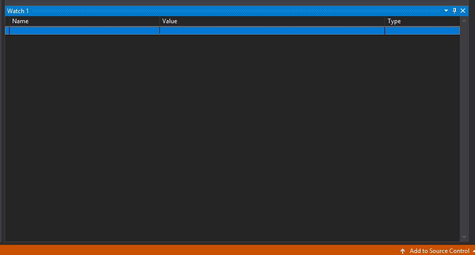
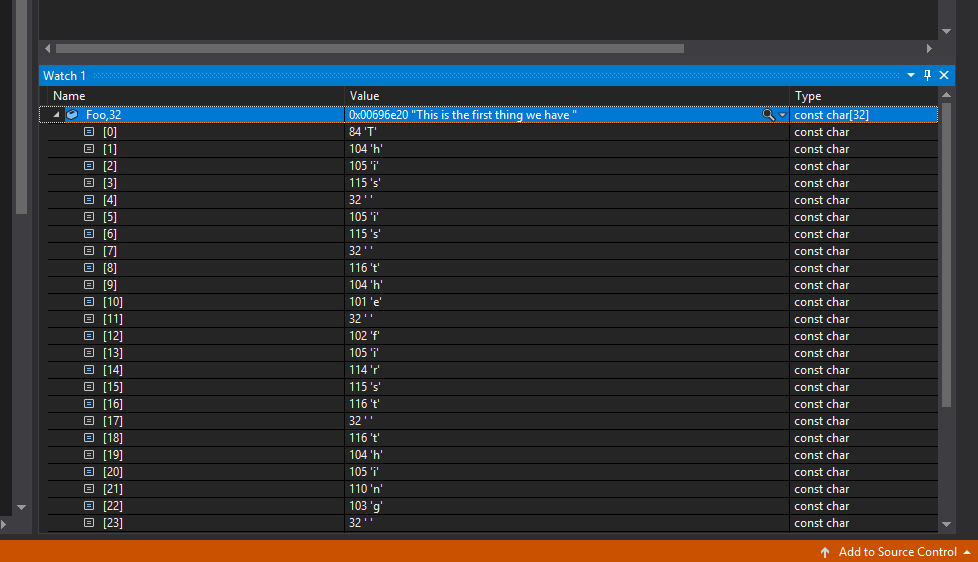
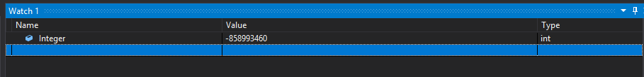
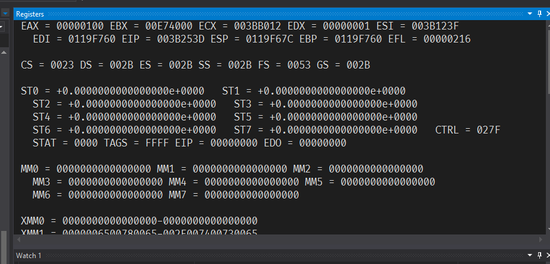

# Intro to C on Windows Day 2

We left off at running the OutputDebugStringA function, it printed it out to the
console.

Now what does the A mean in OutputDebugString:

- Well back in the day, Windows only used ASCII string. (If we search for ASCII
  in the internet, you will see an ASCII table)

So ASCII is a way to encode a certain value to a **Character**. Because, the
only thing we can deal with in computers are numbers, so what they did was
translate "letters" into "numbers".

You see if we ran the OutputDebugString without the A we will get this error:

```cpp
1>------ Build started: Project: test, Configuration: Debug Win32 ------
1>test.cpp
1>c:\users\tsp-windows\source\repos\test\test\test.cpp(5): error C2664: 'void OutputDebugStringW(LPCWSTR)': cannot convert argument 1 from 'const char [34]' to 'LPCWSTR'
1>c:\users\tsp-windows\source\repos\test\test\test.cpp(5): note: Types pointed to are unrelated; conversion requires reinterpret_cast, C-style cast or function-style cast
1>Done building project "test.vcxproj" -- FAILED.
========== Build: 0 succeeded, 1 failed, 0 up-to-date, 0 skipped ==========
```

Now let's get into Visual Studio, and use the debugger to figure this stuff out!
Well to put it simple, instead of running the program through Windows, we are
going to run the program through a tool that allows to find problems of it.

This is the **Start Debugging** button.

We are going to set a breakpoint, which tells the debugger to run the program
till a certain point of code (the breakpoint) and freeze it there.

To set a breakpoint we can either hit F9, and it will set one, at where our
cursor is, or we click on the gutter, then we will see a red dot appear, this is
the breakpoint of the program.

This is one way to set a breakpoint, we will learn about other ways soon.

Now we bring back the A in `OutputDebugStringA` and **Start Debugging**, we will
see a nice arrow on our breakpoint. So basically it went to that line, and it
freezed the program.

So let's close all the windows we have except for the Output and the Code, so we
can find out how to get the windows we want for debugging.

Well now, since we close everything, let us find out where all the windows in
Visual Studio, well you can find some windows in the View tab, but the one that
we are concerned with is the Debug>Windows tab, which houses all the debug
window of Visual Studio. The want we want is Watch, there are multiple, just
bring up 1.

You will see the following:



This basically let's us put in a name of a variable or expression and Visual
Studio will spit out its value.

If we put our string into a variable like Foo:

```cpp
char *Foo = "This is the first thing we have actually printed"
```



Now we can see the actual value of Foo, the first is 84 -> 'T', this means that
in C, it will go through each of the letter and map it to those numbers.

Now why doesn't '\n' appear, this is because it is a special character called
"newline", they are there because it allows us to type things in that are not
built into the keyboard.

Why don't we just return? This is because the C syntax doesn't allow us to add
returns in strings. Now how do they type an actual backslash, we just type two
backslashes ("\\").

Now then if we look at the ASCII table, we might wonder why there are so many
returns, well different OSes uses different kinds of formatting to denote which
is a new line or not, so as an example in Windows, a newline is a 13 and 10, so
13 (\r) moves the cursor down and 10 (\n) moves to the beginning. This is also
called (CRLF).

Basically, most programs in Windows use this convention to denote the end of the
line. However on Unix, we only need to write "\n", for the end of a line.

So let's get back to the `OutputDebugStringA`, so string are just a list of
numbers as we saw, that are mapped via a table, as per the example above, it is
an ASCII table.

Back in the 16 bits days, everything in Windows was ASCII, but then, they found
Unicode, which is for many languages, where ASCII is only for English. In order
to do this though, they had to change all the API in Windows to use an encoding
called UTF-16 or Wide chars.

So if we call just `OutputDebugString` by itself, we don't get an error with
OutputDebugString, we get an error with OutputDebugStringW. So when Windows swap
from ASCII to using Unicode, they wanted all the APIs that they had to be
backwards compatable, so in this case they used something in C called a Macro.

A macro is C is way to replace string, so if we were to go inside the Code for
this we will see the following:

```cpp
#ifdef UNICODE
#define OutputDebugString  OutputDebugStringW
#else
#define OutputDebugString  OutputDebugStringA
#endif // !UNICODE
```

This is basically saying if we are in UNICODE mode use OutputDebugStringW, other
use OutputDebugStringA, so when we start a project in Visual Studio, we get a
choice between UNICODE and ASCII, defaulting to UNICODE, so that macro will
replace OutputDebugString with OutputDebugStringW. So we just do it manually, by
writing out `OutputDebugStringA`.

Now time to talk about varibles!!

The way computer works is that, the CPU (Central Processing Unit) is actually
the thing that does work inside the computer, it is just an engine manipulating
numerical values, this is what it does all day long.

It has a gigantic store called memory, any of the numerial values that is stored
in memory get pulled to the CPU's register then it get put back into memory.

We are going to talk a lot about that model, and that way of thinking gexactly
what the CPU actually is doing or at least mostly what the CPU is doing on an
excpetional level.

Just know that everything we type in code, it is just coming up with different
ways of telling the CPU to manipulate those number, in some way to produce an
outcome.

So in C what we can do is, any time we want some space for these numbers, we can
type `int` (remember that int is a just a type of number), then we are going to
give this a name called Integer and then semi colon.

```c
int Integer;
```

This is a standalone statement that will say give me space for a single numeric
value. Then we can do many thing that looks like math, we can say the Integer is
equals 5:

```c
int Integer = 5;
Integer = 5 + 5;
Integer = Integer + 5;
```

Remember that the equals does not math "equals on both side", it means
assignment, or a copy (copy the right to the left).

So if we go back into debugging mode with this code, and we print the value of
Integer in the watch window we will have the following:



We see there is a value here, there is no value there appear across the program.
So since we haven't given it any value at where our breakpoint is, it can
literally be any value, all C does is reverse space for it, not replace it yet.

To move to the next line all we have to do is in the Debug menu there is
something called Step Over (F10), which will do whatever is on the current line
and move the arrow to the next line, we will see the value change to what we
expect.

However, in C there is not only one way to say number, in C there are a few
ways:

```c
char SmallS; // 8 bits - 256 different values [-128,127]
short MediumS;
int LargeS;

char unsigned SmallU; // 8 bits unsigned [0, 255]
short unsigned MediumU;
int unsigned LargeU;
```

So basically, computers are always operating on bit (0s and 1s), so how do store
bigger things, will they do the same thing as us, they just keep stringing it
together.

So we don't usually talk about things this small, so the smallest thing we
usually talk about which is char that is **8 bits**.

Well, how many numbers can it represent in decimal.

If we have two digit, we do 10^2, 100 numbers to represent, and 10^3 for three
and so on.

So for binary, and 8 bits, that would mean 2^8 or 256.

Well so should a char represent 265, no, since there is something called
unsigned, which means that it doesn't represent negative values, so a normal
char represents [-128, 127], while the **char unsigned** will represent [0,
256].

Now these predefined values, just makes it easier for us to work with. Now then
you might be thinking if the max value of a **char unsigned** is 255, what
happens if we go above it, well, it will just wrap around back to 0. So the CPU
does something called a wrapped addition meaning that is wraps back to 0 (while
saturated addition means that it keeps it at the max), this is also sometimes
called an overflow.

Now if we have the following:

```c
char unsigned Test;

Test = 255;
Test = Test + 255;
```

If we go to look at the assembly (Alt+G on the line or Right-Click and Go to
Assembly) of this, we will get the actual stuff that is happening on the CPU.
Now we open up the Registers window we will see the following:



Well what are register, to boil it down the registers of the CPU, as the CPU go
through your code what it does is, it pull instructions from memory into
registers which is inside the CPU which it can operate on, and then puts it back
into memory.

Now lets look at the assembly:

```asm
  test = 255;
003B252F  mov         byte ptr [test],0FFh  
  test = test + 1;
003B2533  movzx       eax,byte ptr [test]  
003B2537  add         eax,1  
003B253A  mov         byte ptr [test],al
```

003B252F, this is line of code, we are on, it is actually a memory address,
remember that Windows needs to load our code into memory and then point the CPU
to it to start executing.

Now the first asm key word you will see is `mov`, this is a mnemonic or
human-readable keyword of machine language, which the processor can execute,
that means that we want to move one memory address to another.

So what is 0FFh this is just a compact hexadecimal form of it. The `h` just
means its hexadecimal, "0x" gets used by C.

So then the entire `byte ptr [test],0FFh` moves 0FFh (255) into the test byte
ptr, it doesn't need to move it to any registers since it doesn't need to
calculate anything.

Then the second line moves the test to eax register, since now it actually moves
it cause it needs to add 1, then it adds 1 to that register.

Now then the moving "al" back to test, the al means that it is the "a" register
and "l" means to remove take only the bottom 2, since we are a char unsigned and
that is all that we can store.
