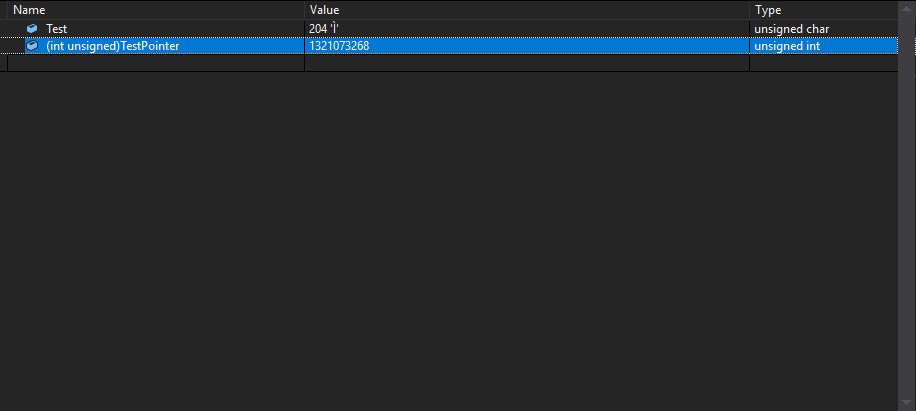
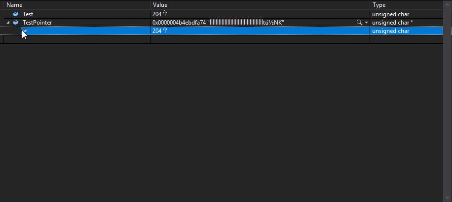
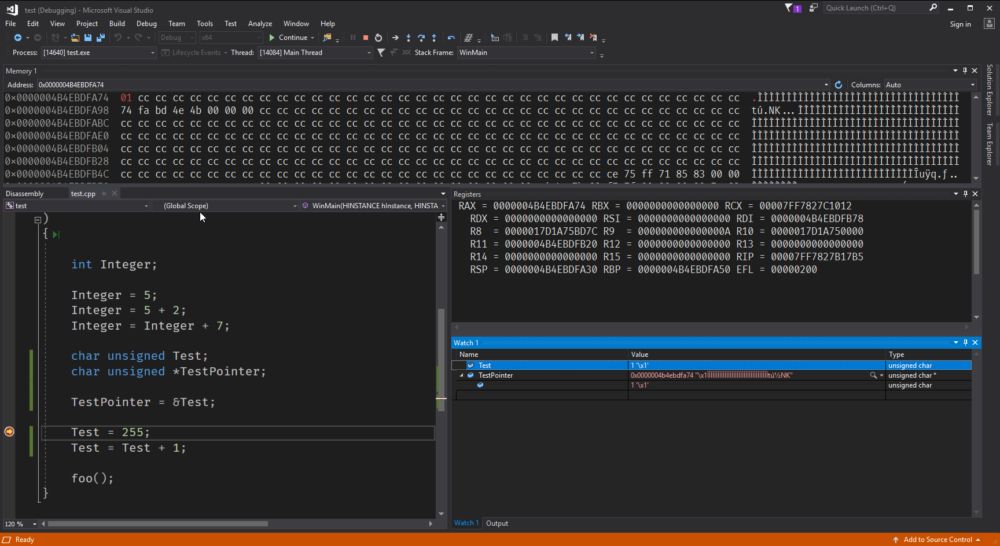
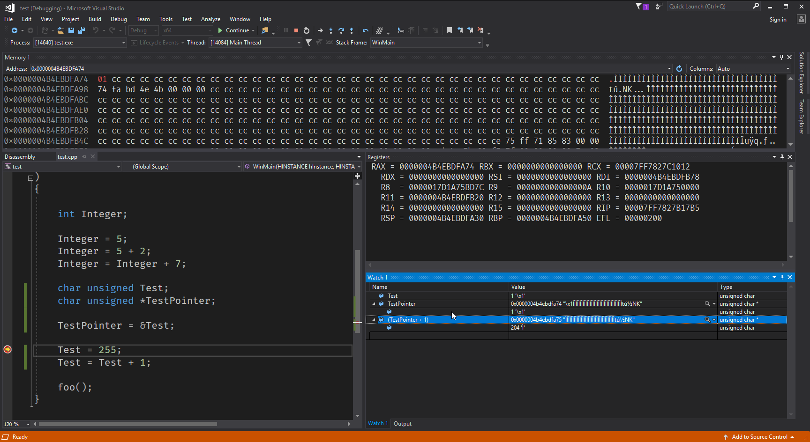
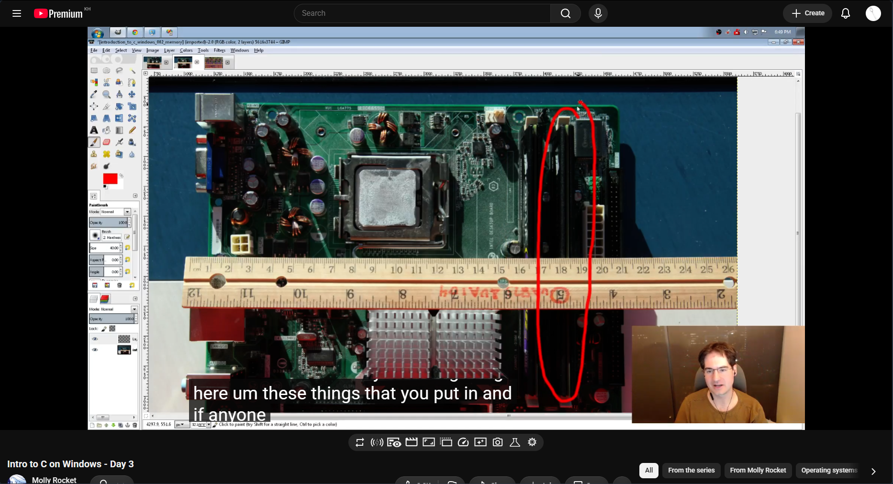
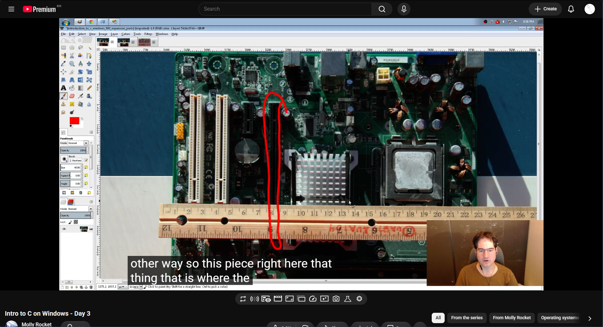
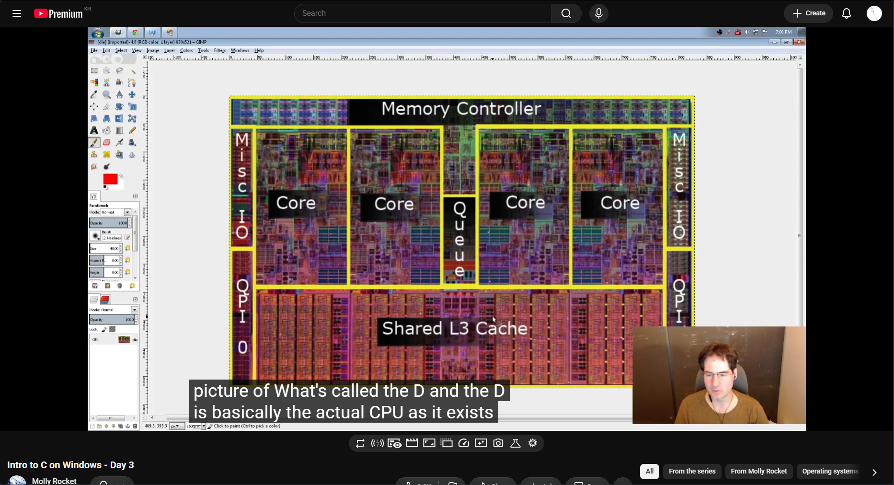

# Intro to C (Day 3)

[Day 3](https://www.youtube.com/watch?v=T4CjOB0y9nI)

Let's talk about memory!!!

The thing with a CPU or a GPU, is that everything is about memory, which means
that all they do is move data around, things like audio and video, is all just
putting the right things into memory, then turn it into the proper electrical
signals to do the stuff it needs to do.

Remember that everything you will be doing is just a CPU instruction to modify
memory in some way.

The first question is:

```c
char unsigned Test;
```

There are 8 bits in a char, but where are they?

Let's look at the following line of instructions:

```c
char unsigned *TestPointer;
TestPointer = &Test;
```

This is a **Pointer** in C, it stores the address of where the variable, or
where the expression is stored in memory. C allows us to mess with this value
like change it, add it, modifying and all. This makes memory a first-class in C.

The `*`, means turns the type, and allows us to talk about **where** the
variable of that type is. While the `&`, is actually where the **Test** variable
is in memory.



So you'd imagine that value, to be the actual address of the **Test** variable
in memory, but actually, it is not, this is due to the fact that modern
computers sub divide the memory even further, into something called **Virtual
Memory**. This is because, on a modern machine there can be 100s of programs
running at once, so to avoid them, stomping on each others memory, we instead
give a program the illusion that it has all the memory to itself (virtually).

- [ ] (TODO)(Talk about Frame and Pages)

Usually, it is fine to talk about this address as real memory, but it is
important to know that the OS can steal our memory or change our memory at any
time, so we got to be careful of it either way.

We changed, the TestPointer from hex to **int unsigned** so its easier to read.



We can also click on the `>`, we can see what the pointer is actually pointing
to, which in this case is the **Test** variable. We can also change the values
in the Watch Window.

Now we Visual Studio, we can also bring up the **Memory Menu**, this is for the
actual virtual address space of our program.



If, I change the value of Test to 1, then you can see in the Memory window, the
value also changes there.



We can also add or do arithmetic on pointers in the Watch Window.

We aren't actually allow to write to memory unless we ask to it.

But you might be wondering, who gave us this memory, well we are writing to a
very special location called the **Stack**, this is something that we get
automatically, where the OS gives it to us automatically, which is usually asked
by the compiler.

When we enter a function, and we write a variable, it starts grabbing the memory
from the end of the stack, it grows, and keeps stacking, remember that nothing
goes away from the middle of it. We are always call and returning function.

```c
void bar(void) {
	int Variable = 255;
}

void foo(void) {
	bar();
}

int CALLBACK WinMain(
	...)
{
	foo();
}
// it always returns at the end
```

However, after this when we try to recompile, the memory location that we have
previously, is different from last time. Due to security concerns, of modern
systems that allows other users to access the memory easily.

Just remember that everything we will do is just manipulate memory. We can do
anything we want afterwards.

Now let us go back to the assembly of our program again, if we have access to
the memory of everything, then the line of the assembly code is actually where
our program is. This is due to the fact that there are flags in pages where the
CPU knows whether the memory being used is executable, this makes us not able to
see it.



The following is the memory, everytime that the CPU has to get data from the
memory, the CPU follows the BUS (wire) to the memory. This is really far
though... Unfortunately, physics care, even if we have the fastest thing in the
world, but CLOCK SPEED (the clock cycle is how long it takes to do one thing),
let us say we have 3.2GHz, if we take the Speed of Light divided by 3.2GHz we
get 9.36cm. This is crazy expensive.

This is why memory is such a big deal in optimisation right now, this is just
due to wires, it is just physically far away.



This part is where the graphics card sits, so the CPU has to go reach the GPU
through those wires as well, so yeah, we are limitted physically.

We have two things we want to deal with:

- Latency
- Throughput and Bandwidth

Latency means that from how long we get all the way around, while the throughput
is the amount of things that we can actually put. The latency can be bad but the
bandwidth and the throughput is a really good way of optimising our application
or game.



This is the actual CPU or what an Intel chip look likes, this is a 4 core
machine, remember that these are the logical pieces of the CPU, meaning that
they are able to perform the action that a single CPU can do.

Each one of these cores have something called an L1 and L2 cache, and there is
an L3 cache that is shared between them. Since latency is such an issue, so
these caches allows us to do this really quickly. If its not in the L1 cache
then it goes to the L2 cache if not the L3 cache then RAM if it doesn't. The
memory controller does all this. It can get even worse if it has to store the
memory interms of Hard Drive or an SSD.

So the CPU have caches it can access which can dump out to main memory later on.
