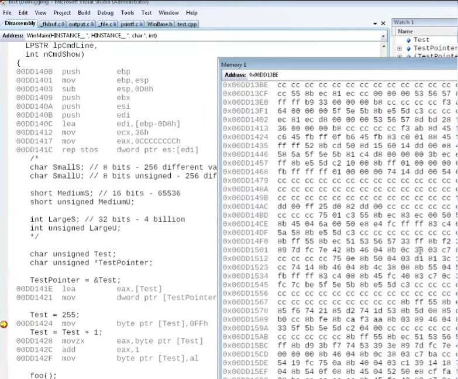
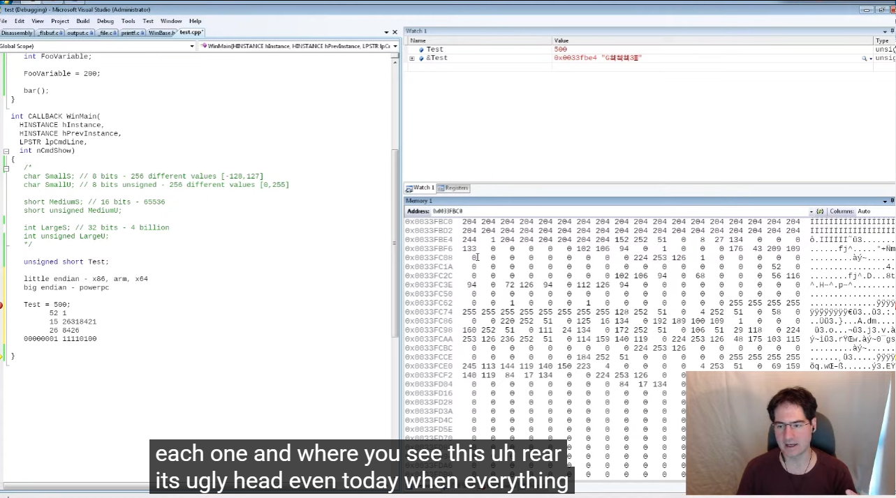

# Intro to C Day 4

In the memory, we can also actually see the code segment, by pasting in the
address to the left of the line of code into the Memory Window.

There are two kinds of philosophies in the CPU: the first is that the
instruction is a fixed amount of bytes, and the second is that the instruction
is a variable amount of bytes.

So basically, if you look at the example above, we can see that some
instructions require four bytes, since one letter represents a byte, while
others require only three bytes. Some are also only one or two...

## Casting and Endianness

There is:

- Little endian: if the low order byte comes first (we are this): x86, arm, x64
- Big endian: if the high order byte comes first: powerpc

The debugger will put cc in everything that is not initialised.

Arrays in C, is automatically pointers to the first one, when you compile it.
